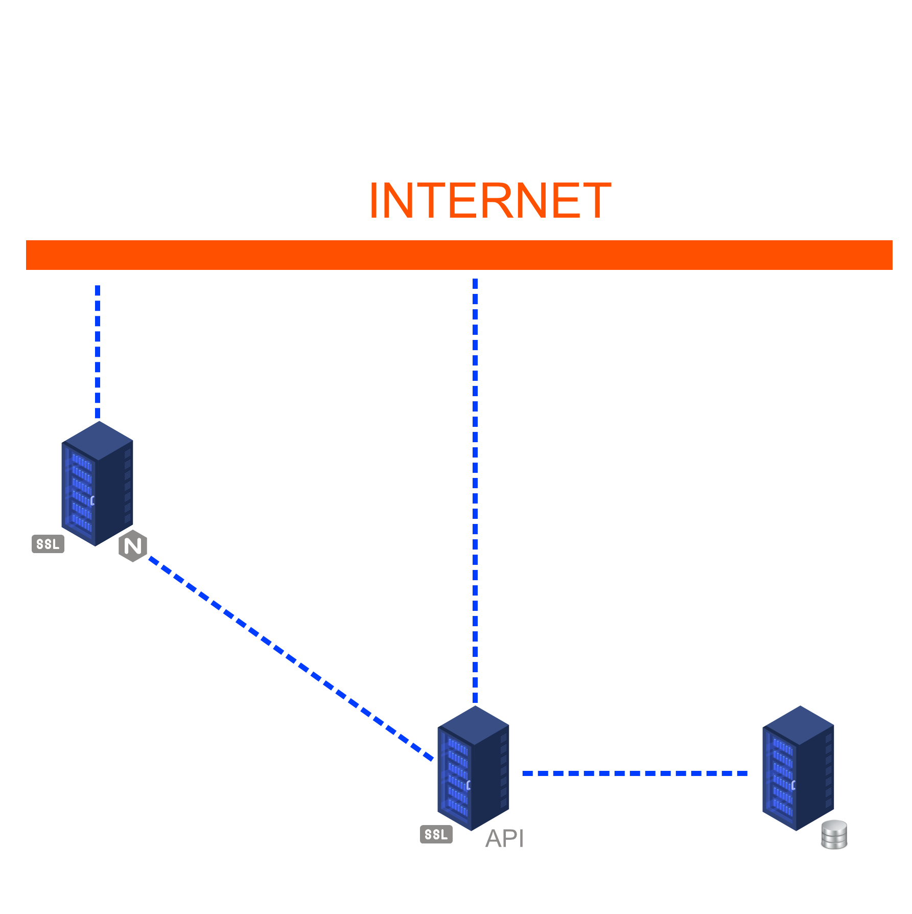
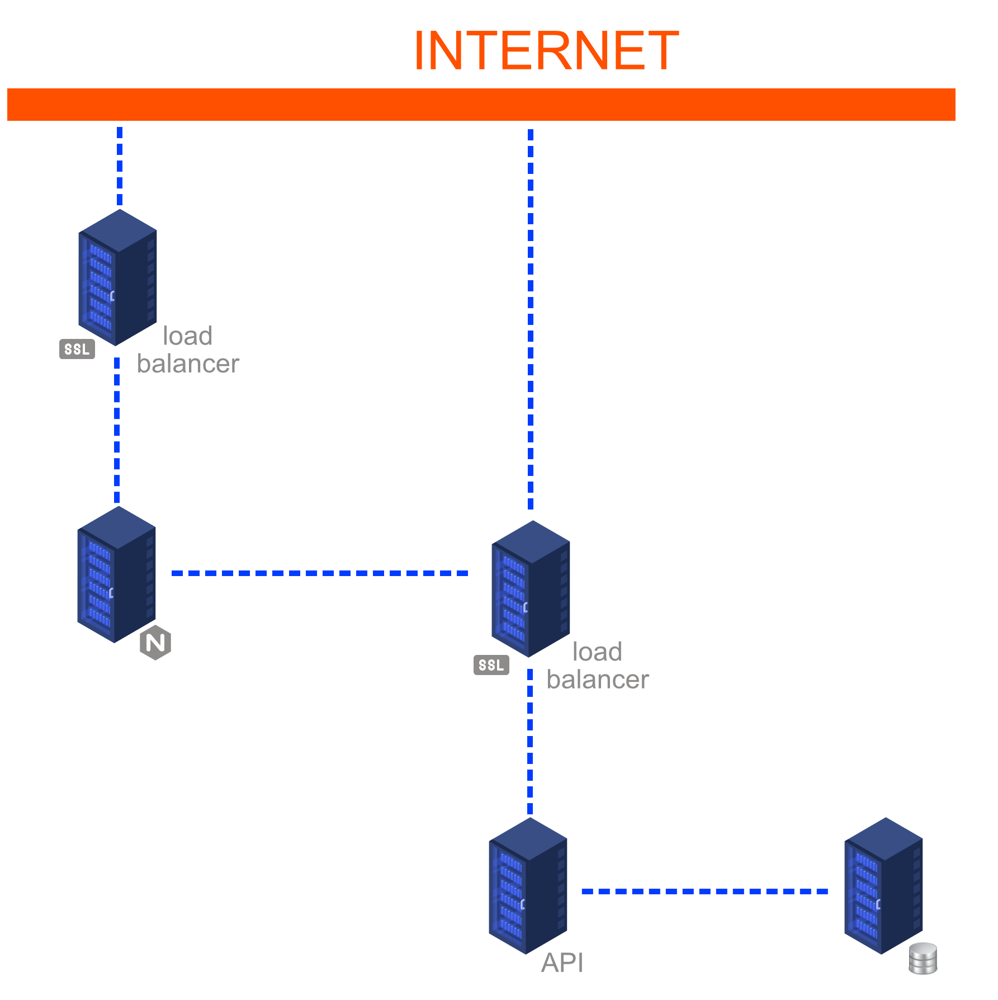

# SurveyStorm

## Introduction

### SurveyStorm provide an API that manages survey creation, edition and statistics, and allows users to answers an enabled survey.

## Team

### [Nathan LAPEYRE](https://github.com/Sarolus) (API Development)

> He likes back & worships tests.

### [Simon BRARD](https://github.com/SimonBr017) (Web back & front development)

> He only swears by HTML/CSS.

### [Adrien MILLOT](https://github.com/adrienmillot) (Mobile back & front development)

> If you're not mobile you're stuck.

## Technologies

### 

**option** : Ruby

> Ruby concerns a smaller population of developer than python and has a lesser range of libraries. Python supporting multiple inheritance is one of the main characteristics we are searching for, and the use of dictionnary type in python is quite a bonus for JSON data format.

### 

**option** : Rails

> Rails works with Ruby language. Developers are more confortable and have more experience with Python language.

### 

**option**: flutter

> You don’t always need to use the platform-native solution to create a successful application even if you think about widening your offer and delivering the same application on other platforms. In our case, we will do it only for one. So the IDE could be the explanation to choose. And XCode is better than VSCode for that.

## Challenge

The goal of this project is to provide a tool that will help people working in the scientific and in the survey fields by letting them build custom surveys. Using database storage for the survey's data and statistics that will be calculated by SurveyStorm. This tool will be accessible to everyone, and the intent is to be able to use it everywhere, from web or mobile.

## Risks

### Technical risks

| Level | Risk | safeguards or alternatives |
| ----- | ---- | -------------------------- |
|       | Not finding enough documentation | Ask to cohort 13 |

### Non-technical risks

| Level | Risk | safeguards or alternatives |
| ----- | ---- | -------------------------- |
|     |Underestimating the colleague's skills | |
|      | Underestimating the difficulty of a task | Set up a `Planning poker`(Scrum method) |
|      | Abandon a colleague | Set up a `Daily`(Scrum method) |

## Deployment strategy

## Branching workflow

We count to use  process, then:

- **main branch**: to production features
- **develop branch**: to test features
- **feature branch**: to development features

Each pull-request on main and develop branch have to be reviewed by two other developers.

## Continuous integration

To ensure a certain parity of our code, we intend to use unit tests with .

To continue with that precision, we intend to implement  to ensure us each pull-request will respect this tests.

## Evolutions workflow

## Infrastructure

### Schema

- Basic infrastructure

- Optimal infrastructure

### Database server

One server to persist data. We can duplicate it and use another one to secure them.

### Application server

We need two application server (python is interpreted language). One for the API, and another one for the web.

We use this configuration to be as close as possible to productivity.

### Web server

We use two Web servers, one server for the mobile application and one server for the web application. 

In the long term potentially four servers could be used, two for the Web app and two for the mobile app, moderate by two loads balancers.

## Existing Solutions

| Order | Name | Similarities | Differences |
| - | - | - | - |
|  | [Survey Monkey](https://www.surveymonkey.com/) | Unlimited surveys & questions, export data (ex. .csv), Mobile App | Statistics, Branch questions
|  | [SoGoSurvey](https://www.sogosurvey.com/) | Unlimited surveys & questions, export data (ex. .csv), Mobile App | Statistics, Branch questions
|  | [Typeform](https://www.typeform.com/surveys/) | Unlimited surveys & questions, export data (ex. .csv), Branch questions | Statistics, Mobile App
|   | [Survey Planet](https://surveyplanet.com/) | Unlimited surveys & questions, export data (ex. .csv), Branch questions, Mobile App | Statistics
|  | [Google Forms](https://docs.google.com/forms/u/0/) | Unlimited surveys & questions, export data (ex. .csv), Branch questions | Statistics, Mobile App
|  | [Survey Gizmo](https://www.alchemer.com/) | Unlimited surveys & questions, export data (ex. .csv) | Statistics, Branch questions, Mobile App

### Other similar solutions

- Qualaroo
- Client Heartbeat
- Zoho Survey
- ProProfs Survey Maker
