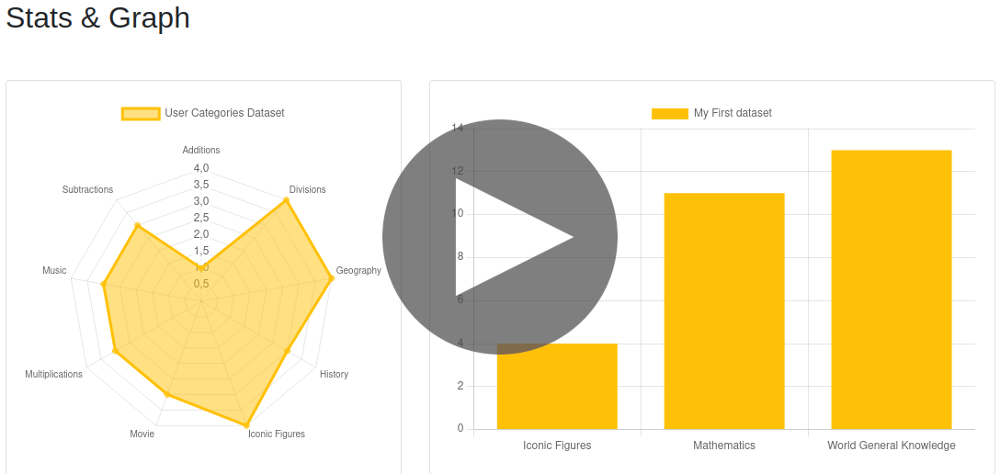

# [SurveyStorm](https://survey-storm.2835holberton.tech/)


## Introduction

SurveyStorm provide an API that manages survey creation, edition and statistics, and allows users to answers an enabled survey.

You access to it >><<

## Team

### Nathan LAPEYRE [](https://github.com/Sarolus) [](https://fr.linkedin.com/in/nathan-lapeyre-376500206) (API Development)

> He likes back & worships tests.

### Simon BRARD [](https://github.com/SimonBr017) [](https://fr.linkedin.com/in/simon-b-2a9820205) (Web back & front development)

> He only swears by HTML/CSS.

### Adrien MILLOT [](https://github.com/adrienmillot) [](https://fr.linkedin.com/in/adrienmillot) (Management & Mobile back & front development)

> If you're not mobile you're stuck.

---

## [I. Project analysis](docs/analysis/project/README.md)

### [1. Technologies](docs/analysis/project/technologies.md)

### [2. Challenge](docs/analysis/project/challenge.md)

### [3. Risks](docs/analysis/project/risks.md)

### [4. Infrastructure](docs/analysis/project/infrastructure.md)

### [5. Existing Solutions](docs/analysis/project/existing_solutions.md)

## [II. Technical analysis](docs/analysis/technical/README.md)

### [1. Minimal viable product (MVP)](docs/analysis/technical/mvp.md)

### [2. Architecture](docs/analysis/technical/architecture.md)

### [3. API documentation](docs/analysis/technical/api/README.md)

### [4. Data modeling](docs/analysis/technical/data_modeling.md)

### [5. Use cases](docs/analysis/technical/use_cases/README.md)

### [6. Mockups](docs/analysis/technical/mockup/README.md)

## [III. Making progress analysis](docs/analysis/making_progress/README.md)

### [1. Progress](docs/analysis/making_progress/progress.md)

### [2. Challenges](docs/analysis/making_progress/challenges.md)

### [3. Collaboration/Communication](docs/analysis/making_progress/collaboration_communication.md)

### [4. Project updates](docs/analysis/making_progress/project_updates.md)

### [5. Screenshots](docs/analysis/making_progress/screenshots.md)

## Installation

### Requirements

You need to have previously installed [docker](https://www.docker.com/) and [docker-compose](https://docs.docker.com/compose/) on your environment 

To install it type in your console:

```bash
docker-compose up -d
```
After that, you will have two environments:
- 1 for the development or the production
- 1 for the tests

You could access to the web site to type [http://survey_storm.localhost](http://survey_storm.localhost)

You could access to the development api from  [http://api_dev.localhost](http://api_dev.localhost)

You could access to the test api from [http://api_test.localhost](http://api_test.localhost)

You could see all this service from traefik container accessible in typing [http://localhost:8080](http://localhost:8080)

## Usage

[](docs/video/demo_survey_storm.mp4)

---
###### 2021 - SurveyStorm - [Article](https://cactussius-primus.medium.com/survey-storm-5a0a2c9e3c86)
