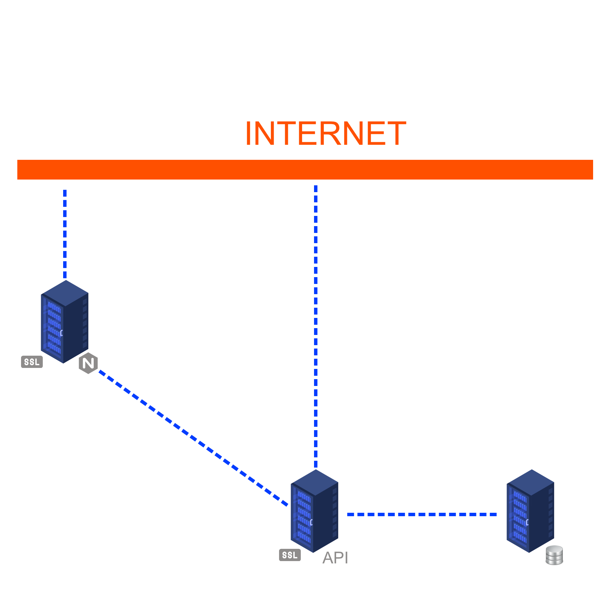
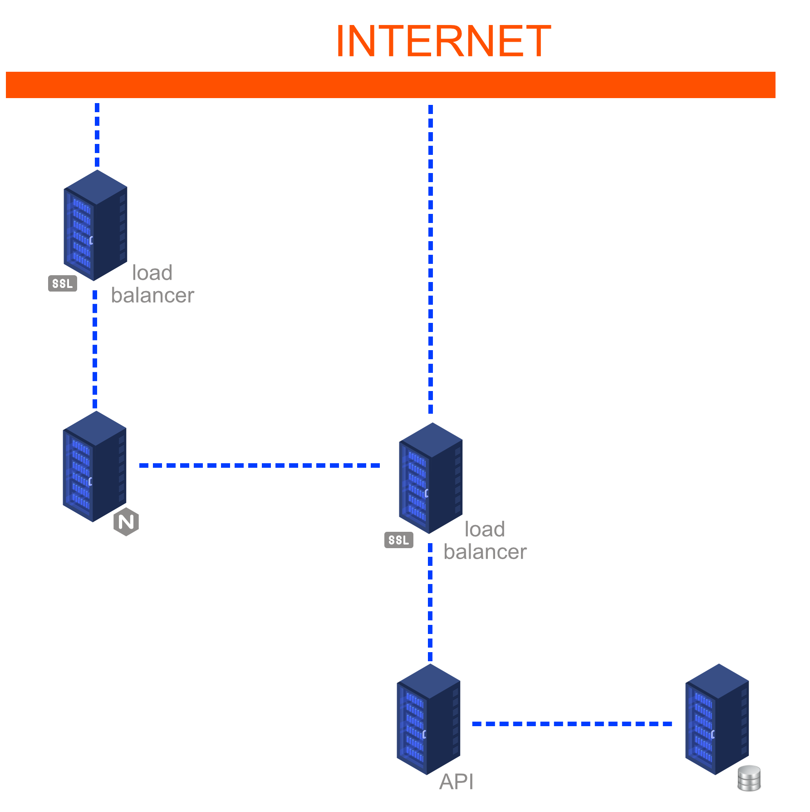

[Index](../../README.md) > [Project analysis](README.md) > Infrastructure

# Infrastructure

## Schema

- Basic infrastructure

- Optimal infrastructure

## Database server

One server to persist data. We can duplicate it and use another one to secure them.

## Application server

We need two application server (python is interpreted language). One for the API, and another one for the web.

We use this configuration to be as closer as possible t productivity.

## Web server

We use two Web servers, one server for the mobile application and one server for the web application. 

In the long term potantially four servers could be used, two for the Web app and two for the mobile app, moderate by two loads balancers.

## Deployment strategy

### Branching workflow

We count to use  process, then:

- **main branch**: to production features
- **develop branch**: to test features
- **feature branch**: to development features

Each pull-request on main and develop branch have to be review by two other developers.

### Continuous integration

To ensure a certain parity of our code, we intend to use unit tests with .

To continue with that precision, we count implement  to ensure us each pull-request will respect this tests.

---
###### 2021 - SurveyStorm
