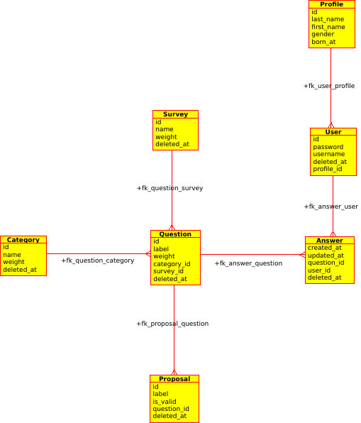

[Index](../../README.md) > [Technical analysis](README.md) > Data modeling

# Data modeling

## Answer

Refers to a user's response.

| Attribute | Description |
| - | - |
| **created_at** | date the user answered the question |
| **updated_at** | date the user updated their answer to the question |
| **question_id** | associate to the question concerned (primary key) |
| **user_id** | associate to the user concerned (primary key) |

## Category

Allows to sectorize entities like questions.

| Attribute | Description |
| - | - |
| **name** | category's name |
| **weight** | weight is a term for the importance of one entity in relation to another |

## Profile

User's personal information. They can be deleted without impacting the operation of the application and statistics.

| Attribute | Description |
| - | - |
| **last_name** | lastname of the user |
| **first_name** | firstname of the user |
| **gender** | gender of the user |
| **born_at** | birthday of the user |

## Proposal

Our questionnaires are multiple choice. The propositions are the different choices that are offered for a question. We can define one choice as a valid answer, or several.

| Attribute | Description |
| - | - |
| **label** | proposal's label |
| **is_valid** | designates the right proposition |
| **question_id** | associate to the question concerned |

## Question

| Attribute | Description |
| - | - |
| **label** | question's label |
| **weight** | weight is a term for the importance of one entity in relation to another |
| **category_id** | associate to the category concerned |
| **survey_id** | associate to the survey concerned |

## Survey

A survey is a set of questions. Therefore, the questions are necessarily attached to a questionnaire.

| Attribute | Description |
| - | - |
| **name** | survey's name |
| **weight** | weight is a term for the importance of one entity in relation to another |

## User

| Attribute | Description |
| - | - |
| **password** | encrypted string allow to authenticate a user |
| **username** | user's name |
| **profile_id** | associate to the profile concerned |

---
###### 2021 - SurveyStorm
