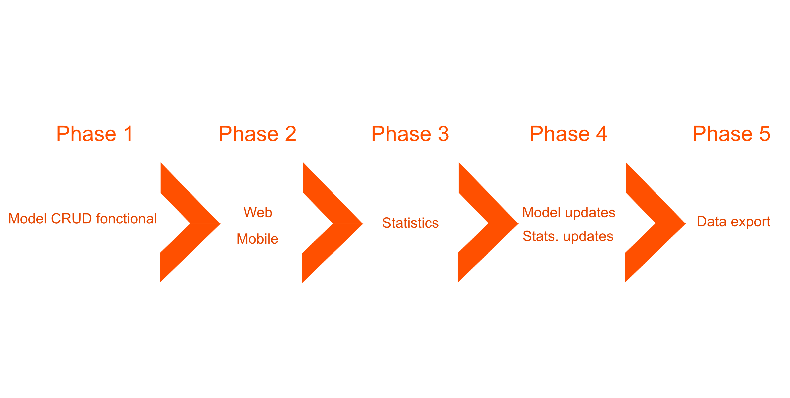

[Index](../../README.md) > [Technical analysis](README.md) > MVP

# Minimal viable product (MVP)

## Phase 1

### Model CRUD functional

`@TODO: Make a description`

## Phase 2

### Web interfaces

`@TODO: Make a description`

### Mobile interfaces

`@TODO: Make a description`

## Phase 3

### Statistics

`@TODO: Make a description`

## Phase 4

### Model updates

`@TODO: Make a description`

### Statistics updates

`@TODO: Make a description`

## Phase 5

### Data exportation

`@TODO: Make a description`

---
###### 2021 - SurveyStorm
