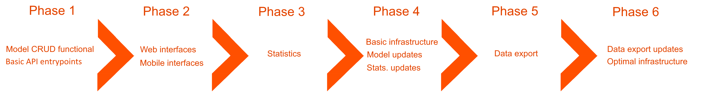

[Index](../../README.md) > [Technical analysis](README.md) > MVP

# Minimal viable product (MVP)

## Phase 1

### Model CRUD functional

- Conception of base model
- Authentification of users
- Conception of database
- Creation of entry points
- Functional minimal API

## Phase 2

### Web interfaces

- Conception of web interfaces
- Conception of web design based on the API
- Operational requests

### Mobile interfaces

- Conception of mobile interface
- Conception of mobile design
- Operational requests

## Phase 3

### Statistics

- Conception of minimal statistics management for the API based on collected datas.
- Add calculate average functionality
- Add midpoint calculation functionality
- Add Lower Limit calculation functionality
- Add Upper Limit calculation functionality

## Phase 4

### Deployment Version 1.0

- [Basic infrastructure](../project/infrastructure.md)
- Establishment of Nginx web server
- Establishment of API server
- Establishment of database server

### Model updates

- Add users permissions (Administrator, Member)
- Add error code 403 management.

### Statistics updates

- Add standard deviation calculation functionality
- Add variance calculation functionality

## Phase 5

### Data exportation

- Add exporting data functionnality in csv format.
- Add exporting data functionality in JSON format.

## Phase 6

### Data exportation updates

- Add exporting data functionality in xml format.
- Add exporting data functionality in yml format.
- Add exporting data functionality in excel format.

### Final Deployment

- [Optimal infrastructure](../project/infrastructure.md)
- Establishment of load balancer for Nginx server.
- Establishment of load balancer for API server.
- Establishment of Firewall for both load balancers.
- Add SSL certificate

---
###### 2021 - SurveyStorm
