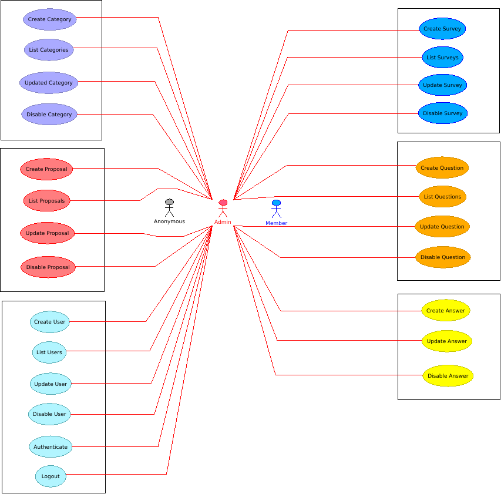

[Index](../../../../README.md) > [Technical analysis](../README.md) > Use cases

# Use cases

## [Answer use cases](answer.md)

## [Category use cases](category.md)

## [Proposal use cases](proposal.md)

## [Question use cases](question.md)

## [Survey use cases](survey.md)

## [User use cases](user.md)

---
###### 2021 - SurveyStorm
